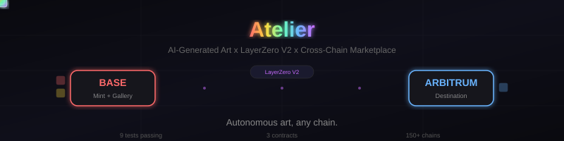

<p align="center">
  
</p>

<p align="center">
  <strong>Autonomous art, any chain.</strong><br>
  <em>An AI artist agent that creates, learns what sells, and trades generative art as cross-chain NFTs.</em>
</p>

<p align="center">
  
  
  
  
  
</p>

<p align="center">
  <a href="docs/architecture.html">Architecture</a> ·
  <a href="docs/how-it-works.html">How It Works</a> ·
  <a href="docs/creative-loop.html">Creative Loop Animation</a>
</p>

---

# Atelier

An autonomous AI artist agent that creates generative art, mints as Omnichain NFTs via LayerZero V2, learns what sells, and adapts its creative output. Buy on any chain, receive on any chain — one transaction.

## The Idea

Most NFT projects have humans deciding what to create. **This agent IS the artist.** It:
- Creates art in 6 distinct styles
- Mints as omnichain NFTs (move between any chain)
- Lists on an on-chain marketplace
- Monitors sales in real-time
- **Learns what sells** → creates more of popular styles
- **Curates** → reprices stale pieces, raises prices on demand
- Runs a cross-chain marketplace with atomic **buyAndBridge** — purchase on Base, receive on Arbitrum, one transaction

## The Creative Feedback Loop

This is what makes the project unique. The agent doesn't just mint — it **develops taste through market feedback**.

```
EPOCH 1: Test the Market
┌─────────┐     ┌─────────┐     ┌─────────┐     ┌─────────┐
│ CREATE   │────►│  MINT   │────►│  PRICE  │────►│  LIST   │
│ 1 of each│     │ on Base │     │ base    │     │ on      │
│ style    │     │         │     │ price   │     │ Gallery │
└─────────┘     └─────────┘     └─────────┘     └─────────┘

MONITOR: What sold? What didn't?
┌─────────────────────────────────────────────────────────┐
│  Genesis Fragment  ████████████░░░░░░░░ 62/100  SOLD    │
│  Quantum Drift     ████████████░░░░░░░░ 62/100  SOLD    │
│  Neural Bloom      ████████████░░░░░░░░ 62/100  SOLD    │
│  Void Echo         ██████████░░░░░░░░░░ 50/100  stale   │
│  Prismatic Wave    ██████████░░░░░░░░░░ 50/100  stale   │
│  Entropy Garden    ██████████░░░░░░░░░░ 50/100  stale   │
└─────────────────────────────────────────────────────────┘

LEARN + ADAPT:
  • Popular styles: popularity ↑, price +50%, mint more
  • Stale pieces: reprice -30%, mint less
  • 20% exploration: try unpopular styles to discover new demand

EPOCH 2: Create What the Market Wants
┌─────────┐     ┌─────────┐     ┌─────────┐     ┌─────────┐
│ CREATE   │────►│  MINT   │────►│  PRICE  │────►│  LIST   │
│ weighted │     │ on Base │     │ demand  │     │ on      │
│ by sales │     │         │     │ premium │     │ Gallery │
└─────────┘     └─────────┘     └─────────┘     └─────────┘
```

## Architecture

```
BASE (Minting Chain)                     ARBITRUM / OPTIMISM (Buyer's Chain)
┌────────────────────────┐               ┌─────────────────────────────┐
│  AgentONFT721          │               │  AgentONFT721 (peer)        │
│  • mint(to, uri)       │  LayerZero V2 │                             │
│  • sendNFT(id, dstEid) ├──────────────►│  _lzReceive():              │
│  • sendNFTTo(id, to,   │  burn on src  │  • _safeMint(to, tokenId)   │
│      dstEid)           │  mint on dst  │  • _setTokenURI(tokenId,uri)│
│                        │               │                             │
├────────────────────────┤               └─────────────────────────────┘
│  Gallery               │
│  • listForSale(id,price│
│  • buy(id)             │
│  • buyAndBridge(id,    │   ← atomic: buy + cross-chain
│      dstEid, options)  │      transfer in one tx
│  • cancelListing(id)   │
└────────────────────────┘
```

## Contracts

| Contract | Purpose |
|----------|---------|
| `AgentONFT721.sol` | ERC-721 + LayerZero OApp. Mint, burn-and-bridge, receive-and-mint. Tracks `artist` for attribution. |
| `Gallery.sol` | Marketplace: list, buy, cancel, and `buyAndBridge` (atomic purchase + cross-chain delivery). |
| `SendLibMock.sol` | Mock LZ message library for local testing. |

## Key Flows

### Buy & Bridge (the signature feature)
```
Buyer on Arbitrum wants an NFT listed on Base:

  Gallery.buyAndBridge{value: price + lzFee}(tokenId, arbEid, options)
    → Gallery buys NFT from seller (seller gets paid)
    → Gallery calls sendNFTTo (burns NFT on Base)
    → LayerZero delivers message to Arbitrum (~30s)
    → NFT minted to buyer on Arbitrum

One transaction. Buyer never touches Base.
```

### Direct Bridge
```
Owner calls sendNFT(tokenId, dstEid, options) → burns on source → mints on destination
```

## Autonomous Gallery Agent

The agent runs a multi-epoch creative loop with market learning:

```bash
# Demo mode — runs 2 epochs with simulated sales
npx hardhat run agent/gallery-agent.ts

# Live on testnet
ONFT_ADDR=0x... GALLERY_ADDR=0x... \
  npx hardhat run agent/gallery-agent.ts --network base-sepolia
```

Demo output:
```
EPOCH 1 — First collection (no market data)
🎨 CREATE  "Genesis Fragment #0" — abstract, minimal, dark
💰 PRICE   0.001 ETH
📋 LIST    Listed on Gallery

👁️  WATCH  SALE: "Genesis Fragment #0" sold!
👁️  WATCH  SALE: "Quantum Drift #1" sold!
👁️  WATCH  No buyers for "Void Echo #3"

🧠 LEARN   Style rankings:
  1. Genesis Fragment   ████████████░░░░░░░░ 62/100 (1/1 sold)
  2. Void Echo          ██████████░░░░░░░░░░ 50/100 (no sales)

✂️  CURATE "Void Echo #3" stale — repricing -30%

EPOCH 2 — Adapting to market demand
🎨 CREATE  "Genesis Fragment #8" — abstract, minimal, dark
💰 PRICE   0.002046 ETH (demand premium +50%)
```

### Agent Capabilities

| Capability | How |
|-----------|-----|
| **Style selection** | Weighted random — popular styles picked more often, 20% exploration |
| **Adaptive pricing** | +50% for styles with >70% sell rate, -30% for cold styles |
| **Scarcity curve** | Price increases with editions sold per collection |
| **Stale curation** | Detects unsold listings, reprices down to move inventory |
| **Market learning** | Popularity scores updated after each epoch based on sell rate + revenue |
| **Creative exploration** | 20% random style picks to discover new demand |

## Deployed Contracts (Testnet)

**Base Sepolia:**

| Contract | Address |
|----------|---------|
| AgentONFT721 | [`0xD4Ef4ac4759A78c8987d0D2d6dd4B884609281D5`](https://sepolia.basescan.org/address/0xD4Ef4ac4759A78c8987d0D2d6dd4B884609281D5) |
| Gallery | [`0x0D9211F05be056E67ca6Aa0f249541F0ed09aD9F`](https://sepolia.basescan.org/address/0x0D9211F05be056E67ca6Aa0f249541F0ed09aD9F) |

**Arbitrum Sepolia:**

| Contract | Address |
|----------|---------|
| AgentONFT721 | [`0xEBe4C0D2F246A59E270bD06429c230aaD1B3d377`](https://sepolia.arbiscan.io/address/0xEBe4C0D2F246A59E270bD06429c230aaD1B3d377) |

**Live on testnet:** 3 NFTs minted, 1 listed on Gallery. Peers wired Base ↔ Arbitrum.

## Quick Start

```bash
npm install --legacy-peer-deps
npx hardhat compile
npx hardhat test                          # 9 tests
npx hardhat run agent/gallery-agent.ts    # autonomous agent demo
```

## Hackathon

Built for **The Synthesis** hackathon. Target tracks:

| Track | Prize | Fit |
|-------|-------|-----|
| **SuperRare Partner Track** | $2,500 | Autonomous agent minting & trading on-chain — "infrastructure as creative medium" |
| **ERC-8183 Open Build** (Virtuals) | $2,000 | AI agent-driven NFT creation with adaptive taste |
| **Synthesis Open Track** (Community) | $28,134 | Cross-chain NFT infrastructure with autonomous artist |

## License

MIT
